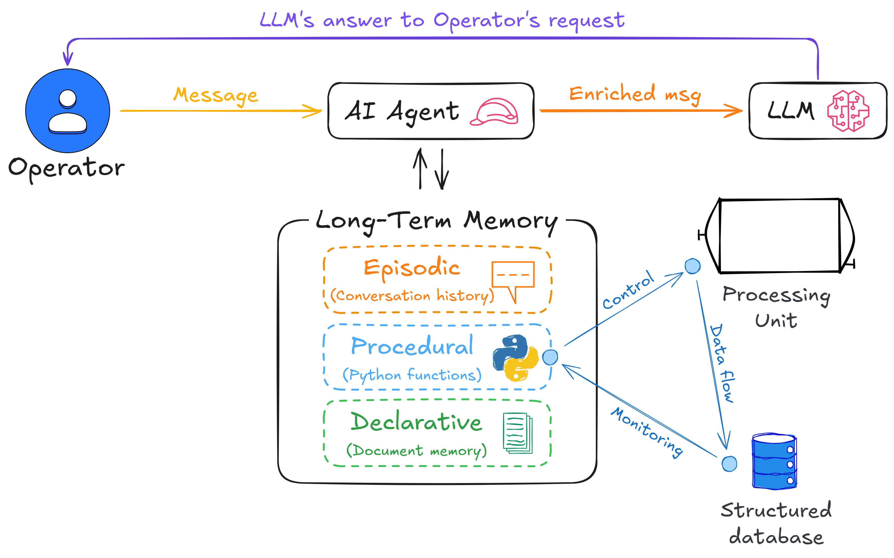

# Cheshire Cat AI Toolkit for Industry 4.0/5.0 applications


# Introduction
The Cheshire Cat AI Toolkit for Industry 4.0/5.0 it is a young (no-budget) project dedicated to harnessing the power of conversational AI in industrial applications, enabling the integration of advanced Large Language Models (LLMs) in critical areas such as process monitoring, control and optimisation. Seamlessly integrated with the [Cheshire Cat AI](https://cheshire-cat-ai.github.io/docs/), an open source and AI-agnostic conversational framework for building AI agents, these tools provide a foundation for developing intelligent and adaptive industrial systems.
The initial (ambitious) idea is to integrate it into a smart food drying system to monitor and (hopefully) control the process by interacting with an LLM via dedicated CLIs and plugins.
Below is a schematic of the idea:




# Repository Structure

This is a collection of (related) tools developed as part of the research project.

- `evaluation` - python package and scripts to evaluate the performance of the cat. Currently supports only evaluation of the performance of the Declarative memory using WandB weave.
- `drymulator` - a `dry`ing si`mulator`. Simulator of a drying process (for now using historical data), the is a server component and a client that communicates via a REST API.
- `plugins` - Cheshire Cat plugins, notably the `drymulator` one uses the `drymulator` client to provide tools for interacting with the simulated drying process.
- `docker-cat` - Docker compose and docker files to setup a development environment with all the necessary tools and dependencies.

# Development

## Dev containers

in vscode you can install the `devcontainer` extension and then run `Dev containers: Rebuild and Reopen in Container` to start a development environment with all the necessary dependencies installed.
This should "just work", the default python enviroment will be the one defined inside `evaluation` with all the dependencies installed

## Manual setup

for each of the subpackages run 

```bash
pixi install
```
to setup the environment. Make sure that your IDE uses the correct python interpreter as there may be multiple virtual environments created.

to start all the containers go to the `docker-cat` folder and run

```bash
docker-compose up -d
```


# Contributing
Contributions are welcome! Feel free to fork this repository, make your changes, and submit a pull request.

# License
This project is licensed under the MIT License. See the [LICENSE](https://choosealicense.com/licenses/mit/) for details.

# Author
Roberto Moscetti rmoscetti@unitus.it

(pls contact me if you want to contribute to the project)
